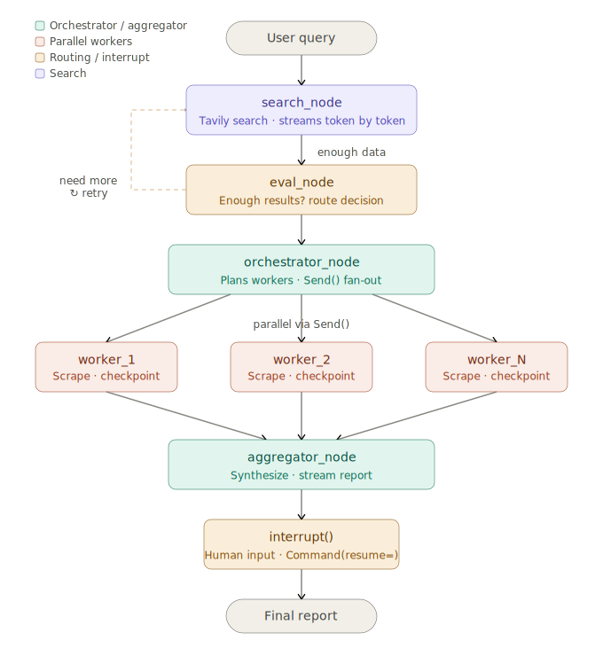

# AI Shopping Research Agent

A LangGraph-powered agent that researches any product query, scrapes multiple sources in parallel, and delivers a structured comparison report — with live streaming, persistent sessions, and human-in-the-loop control.

Built as a focused mini project to solidify LangGraph fundamentals: **streaming**, **checkpointing**, **persistence**, and **interrupts**.

---

## What it does

Give it a query like `"best wireless headphones under 5000 rupees"` and it will:

1. Search the web via Tavily and stream results live
2. Evaluate if there's enough data — retry if not (up to 3x)
3. Spin up parallel scraper workers for each URL
4. Aggregate and synthesize all findings
5. Pause and ask you a clarifying question before the final report
6. Resume from where it left off — even after a crash

---

## Architecture



---

## LangGraph concepts covered

| Concept | Where it's used |
|---|---|
| `StateGraph` + `TypedDict` | `state.py` — defines shared state across all nodes |
| `add_conditional_edges` | `eval_node` — routes between search retry and orchestrator |
| `Send()` API | `orchestrator_node` — fans out to N parallel worker nodes |
| `Annotated[list, operator.add]` | `ShoppingState.scraped_data` — safe parallel writes |
| `.stream()` + `stream_mode="updates"` | `main.py` — live output as each node completes |
| `SqliteSaver` | `main.py` — checkpoints state after every node to `shopping.db` |
| `thread_id` | `main.py` — identifies sessions, enables resume after crash |
| `interrupt()` | `aggregator_node` — pauses graph for human input |
| `Command(resume=)` | `main.py` — resumes graph with user's answer |

---

## Project structure

```
shopping_agent/
├── main.py              # entry point — stream, interrupt, resume
├── graph.py             # StateGraph wiring — all nodes and edges
├── state.py             # ShoppingState and WorkerState TypedDicts
├── nodes/
│   ├── search.py        # search_node (Tavily)
│   ├── evaluator.py     # eval_node + route_after_eval
│   ├── orchestrator.py  # orchestrator_node + assign_workers
│   ├── worker.py        # worker_node (httpx + BeautifulSoup + LLM)
│   └── aggregator.py    # aggregator_node + interrupt
└── shopping.db          # auto-created — SQLite checkpoint store
```

---

## Setup

```bash
# Install dependencies
uv add langgraph langchain-openai langchain-core tavily-python \
       httpx beautifulsoup4 pydantic langgraph-checkpoint-sqlite

# Set API keys
export OPENAI_API_KEY=your_key_here
export TAVILY_API_KEY=your_key_here     # free tier at tavily.com

# Run
python main.py
```

---

## How persistence and resume work

Every node completion is saved to `shopping.db` under a `thread_id`. To resume a crashed session:

```python
# First run — starts fresh
config = {"configurable": {"thread_id": "session-001"}}

# Second run with same thread_id — resumes from last checkpoint
config = {"configurable": {"thread_id": "session-001"}}
```

To inspect all checkpoints for a session:

```python
for state in graph.get_state_history(config):
    print(state.metadata)
```

---

## Stack

- [LangGraph](https://github.com/langchain-ai/langgraph) — agent orchestration
- [LangChain Anthropic](https://python.langchain.com/docs/integrations/chat/anthropic/) — Claude as the LLM
- [Tavily](https://tavily.com) — LLM-native web search
- [httpx](https://www.python-httpx.org/) + [BeautifulSoup4](https://www.crummy.com/software/BeautifulSoup/) — web scraping
- SQLite — local checkpoint persistence (zero infra)
